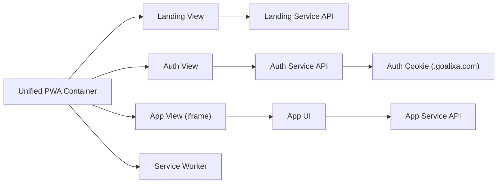

# Architecture

The PWA is a static, vanilla JS container that hosts three experiences while keeping the backend as three independent services. The container owns routing, auth state, and offline behavior. The App view is embedded via an `iframe`.

**Key responsibilities**
- Router: `js/router.js` handles hash routes and view loading.
- Auth: `js/auth.js` manages tokens, cookies, and cross-view auth state.
- API client: `js/api.js` wraps calls to all services with consistent behavior.
- Offline: `sw.js` caches static assets and provides offline fallbacks.
- App embedding: `js/views/app-view.js` embeds the app and syncs auth via `postMessage`.

**Data flow summary**
1. User loads `index.html` from the root domain.
2. Router renders Landing, Auth, or App view based on hash route.
3. Auth view calls Auth API and stores token in cookie `goalixa_auth`.
4. App view loads `https://app.goalixa.com` in an iframe.
5. Auth token is shared to the iframe with `postMessage`.
6. Service worker handles caching and offline navigation fallback.
