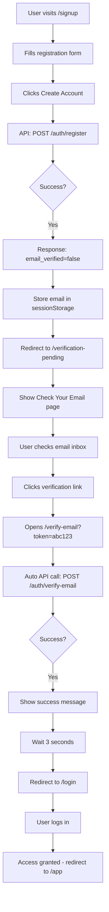
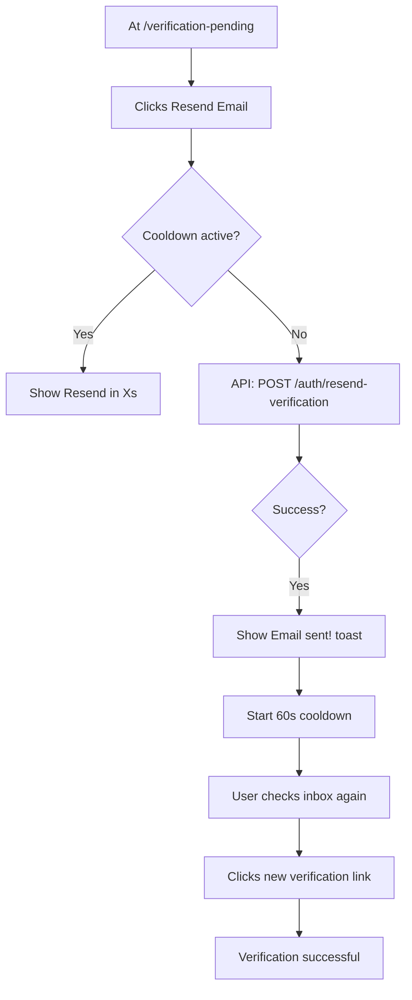

# Email Verification Frontend Integration - Design Specification

**Date**: 2026-05-06
**Author**: Claude (with user approval)
**Status**: Approved
**Target**: goalixa-pwa main branch

---

## Overview

This specification details the frontend implementation for email verification in the Goalixa PWA. The backend email verification system is already complete (implemented 2026-05-05). This design covers the user-facing pages, components, and flows needed to integrate with the backend API.

## Background

### Current State
- ✅ Backend email verification API complete (`goalixa-auth`)
- ✅ Email sending on registration
- ✅ Login blocking for unverified users (403)
- ✅ Resend verification endpoint with rate limiting
- ✅ Google OAuth auto-verification
- ❌ Frontend integration missing (this spec)

### Backend API Endpoints
1. `POST /bff/auth/register` - Returns `email_verified: false` + sends email
2. `POST /bff/auth/verify-email` - Verifies token from email link
3. `POST /bff/auth/resend-verification` - Resends verification email
4. `POST /bff/auth/login` - Returns `403` with `email_verified: false` if unverified

---

## User Experience Goals

1. **Clear Communication**: Users understand they need to verify their email
2. **Minimal Friction**: Easy to resend verification emails
3. **Error Recovery**: Clear guidance when links expire or fail
4. **Consistent Design**: Matches existing auth page aesthetics
5. **Accessibility**: Keyboard navigable, screen reader friendly

---

## Design Decisions (User-Approved)

| Decision Point | Choice | Rationale |
|----------------|--------|-----------|
| Post-registration flow | Redirect to `/verification-pending` | Clear dedicated page, focused UX |
| Email link handling | Dedicated `/verify-email` page | Professional, handles all states cleanly |
| Login 403 error | Inline alert with resend button | Contextual, no navigation disruption |

---

## Architecture

### New Routes

```javascript
// Add to router.js
const routes = {
  // ... existing routes
  '/verify-email': {
    view: 'auth',
    title: 'Goalixa - Verify Email'
  },
  '/verification-pending': {
    view: 'auth',
    title: 'Goalixa - Check Your Email'
  }
};
```

### New View Modes

The `auth-view.js` module will be extended with two new modes:

1. **`verify-email`** - Handles email verification from link clicks
2. **`verification-pending`** - Post-registration "check your email" page

---

## Component Specifications

### 1. Verification Pending Page (`/verification-pending`)

**Purpose**: Landing page after registration, prompting user to check email.

**URL Parameters**:
- `email` (required) - User's email address

**Visual Layout**:
```
┌──────────────────────────────────┐
│          [Goalixa Logo]          │
│                                  │
│      Check Your Email 📧         │
│                                  │
│  We sent a verification link to: │
│      user@example.com            │
│                                  │
│  [Resend Verification Email]     │
│  (or "Resend in 42s...")         │
│                                  │
│  Didn't receive it?              │
│  • Check your spam folder        │
│  • Make sure email is correct    │
│                                  │
│  ← Back to registration          │
└──────────────────────────────────┘
```

**States**:
- **Default**: Shows resend button
- **Cooldown**: Shows countdown timer (60s)
- **Sending**: Button shows loading spinner
- **Success**: Toast notification "Email sent!"
- **Error**: Toast notification with error message

**Behavior**:
- Display email from URL parameter
- Track resend cooldown in component state
- Store last resend timestamp in sessionStorage
- Call `authApi.resendVerification(email)` on button click
- Rate limiting handled by backend (frontend shows countdown)

---

### 2. Verify Email Page (`/verify-email`)

**Purpose**: Processes email verification token from email link.

**URL Parameters**:
- `token` (required) - Verification token from email

**Visual Layout**:
```
┌──────────────────────────────────┐
│          [Goalixa Logo]          │
│                                  │
│  [Loading State]                 │
│  Verifying your email...         │
│  [Spinner Animation]             │
│                                  │
│  --- OR (Success) ---            │
│                                  │
│  ✓ Email Verified!               │
│  Welcome to Goalixa              │
│  Redirecting to login...         │
│                                  │
│  --- OR (Error) ---              │
│                                  │
│  ✗ Verification Failed           │
│  This link is invalid or expired │
│                                  │
│  [Resend Verification Email]     │
│                                  │
│  ← Back to login                 │
└──────────────────────────────────┘
```

**States**:
- **Loading**: Auto-starts on mount, calls API
- **Success**: Shows success message, auto-redirects in 3s
- **Error**: Shows error with resend option
- **Resend Form**: Email input + submit button

**Behavior**:
1. Extract `token` from URL on page load
2. Immediately call `authApi.verifyEmail(token)`
3. **On Success**:
   - Show success message with checkmark animation
   - Wait 3 seconds
   - Redirect to `/login` with success toast
4. **On Error**:
   - Parse error type (expired, invalid, already used)
   - Show appropriate error message
   - Show resend form (email input + button)
   - On resend submit → call `authApi.resendVerification(email)`

**Error Messages**:
- `400` (invalid/expired): "This verification link has expired. Request a new one below."
- `404` (user not found): "Invalid verification link. Please register again."
- Already verified: "This email is already verified. You can log in now."
- Network error: "Connection error. Please check your internet and try again."

---

### 3. Login Page Updates (`/login`)

**Purpose**: Handle 403 errors for unverified users, show inline alert.

**New Behavior**:
When login returns `403` with `email_verified: false`:

**Visual Addition** (inserted above login form):
```
┌──────────────────────────────────┐
│  ⚠️ Email Verification Required  │
│                                  │
│  Please verify your email:       │
│  user@example.com                │
│                                  │
│  [Resend Verification Email]     │
│  (or "Email sent! Check inbox")  │
└──────────────────────────────────┘
│                                  │
│  [Normal Login Form Below]       │
```

**Implementation**:
- Add `verification-alert` div to login form HTML (hidden by default)
- On login error with `email_verified: false`:
  - Show alert div with user's email
  - Render resend button with cooldown logic
  - Track resend state in component
- Alert is dismissible (X button) but persists on page reload

---

### 4. Registration Page Updates (`/signup`)

**Purpose**: Redirect to verification pending page after successful registration.

**Current Flow**:
```
Submit Form → API Call → Success → redirectAfterLogin() → /app
```

**New Flow**:
```
Submit Form → API Call → Success (email_verified: false)
→ Store email in sessionStorage
→ navigate('/verification-pending?email=user@example.com')
```

**Code Changes**:
```javascript
// In signup form submit handler
const result = await register(userData);

if (result.success) {
  // Check if email needs verification
  if (result.email_verified === false) {
    // Store email for resend functionality
    sessionStorage.setItem('pending_verification_email', result.user.email);

    // Redirect to verification pending page
    navigate(`/verification-pending?email=${encodeURIComponent(result.user.email)}`);
  } else {
    // Google OAuth or already verified - proceed normally
    showToast('Welcome to Goalixa!', 'success');
    redirectAfterLogin();
  }
}
```

---

## API Integration

### New Methods in `api.js`

```javascript
export const authApi = {
  // ... existing methods

  /**
   * Verify email with token
   * @param {string} token - Verification token from email
   * @returns {Promise<{success: boolean, message?: string, error?: string}>}
   */
  async verifyEmail(token) {
    return apiRequest(buildUrl('/auth/verify-email'), {
      method: 'POST',
      body: { token }
    });
  },

  /**
   * Resend verification email
   * @param {string} email - User's email address
   * @returns {Promise<{success: boolean, message?: string, error?: string}>}
   */
  async resendVerification(email) {
    return apiRequest(buildUrl('/auth/resend-verification'), {
      method: 'POST',
      body: { email }
    });
  }
};
```

### Updated Methods in `auth.js`

```javascript
/**
 * Register new user
 * Modified to handle email verification flow
 */
export async function register(userData) {
  try {
    const response = await authApi.register(userData);

    if (response.success || response.user) {
      // Check if email verification is required
      if (response.email_verified === false) {
        // Don't set auth state - user must verify first
        return {
          success: true,
          user: response.user,
          email_verified: false,
          message: response.message
        };
      }

      // Google OAuth or already verified - set auth state normally
      authState.isAuthenticated = true;
      authState.user = response.user;
      // ... rest of normal flow
    }
  } catch (error) {
    // ... error handling
  }
}

/**
 * Login user
 * Modified to detect unverified email errors
 */
export async function login(email, password) {
  try {
    const response = await authApi.login(email, password);

    if (response.success || response.user) {
      // Normal successful login flow
      // ...
    }

    return { success: false, error: 'Invalid response from server' };
  } catch (error) {
    // Check for 403 with email_verified flag
    if (error.status === 403 && error.email_verified === false) {
      return {
        success: false,
        error: error.message || 'Please verify your email address before logging in.',
        email_verified: false,
        email: email  // Include email for resend functionality
      };
    }

    // ... other error handling
  }
}
```

---

## UI Components

### Reusable: Verification Alert Component

**HTML Structure**:
```html
<div class="verification-alert" role="alert">
  <div class="alert-icon">
    <i class="fas fa-envelope-circle-check"></i>
  </div>
  <div class="alert-content">
    <h3 class="alert-title">Verify Your Email</h3>
    <p class="alert-message">
      We sent a verification link to <strong class="user-email">user@example.com</strong>
    </p>
    <div class="alert-actions">
      <button class="btn btn-primary resend-button" data-action="resend">
        <span class="btn-text">Resend Email</span>
        <i class="fas fa-spinner fa-spin" style="display: none;"></i>
      </button>
      <span class="resend-timer" style="display: none;">
        Resend in <span class="countdown">60</span>s
      </span>
      <span class="resend-success" style="display: none;">
        ✓ Email sent! Check your inbox
      </span>
    </div>
  </div>
  <button class="alert-close" aria-label="Close">
    <i class="fas fa-times"></i>
  </button>
</div>
```

**CSS Classes** (add to `css/styles.css`):
```css
.verification-alert {
  background: var(--surface-elevated);
  border: 1px solid var(--border-default);
  border-left: 4px solid var(--primary);
  border-radius: var(--radius-lg);
  padding: var(--space-4);
  margin-bottom: var(--space-4);
  display: flex;
  gap: var(--space-3);
  align-items: flex-start;
}

.verification-alert .alert-icon {
  font-size: 2rem;
  color: var(--primary);
}

.verification-alert .alert-content {
  flex: 1;
}

.verification-alert .alert-title {
  font-size: var(--text-lg);
  font-weight: var(--font-semibold);
  margin-bottom: var(--space-1);
}

.verification-alert .user-email {
  color: var(--primary);
}

.verification-alert .alert-actions {
  margin-top: var(--space-3);
  display: flex;
  align-items: center;
  gap: var(--space-3);
}

.verification-alert .resend-timer {
  font-size: var(--text-sm);
  color: var(--text-secondary);
}

.verification-alert .resend-success {
  font-size: var(--text-sm);
  color: var(--success);
  display: flex;
  align-items: center;
  gap: var(--space-1);
}

.verification-alert .alert-close {
  background: none;
  border: none;
  color: var(--text-tertiary);
  cursor: pointer;
  padding: var(--space-1);
  transition: color 0.2s;
}

.verification-alert .alert-close:hover {
  color: var(--text-primary);
}
```

**JavaScript Behavior**:
```javascript
class VerificationAlert {
  constructor(container, email, onResend) {
    this.container = container;
    this.email = email;
    this.onResend = onResend;
    this.cooldownSeconds = 60;
    this.cooldownTimer = null;
  }

  render() {
    // Render HTML
    // Attach event listeners
    // Check for existing cooldown in sessionStorage
    // Start timer if cooldown active
  }

  async handleResend() {
    // Disable button, show loading
    // Call onResend callback (API call)
    // Start 60s cooldown
    // Store timestamp in sessionStorage
    // Show success message
  }

  startCooldown(seconds) {
    // Hide button, show timer
    // Countdown every second
    // When done, show button again
  }

  destroy() {
    // Clear timer
    // Remove event listeners
  }
}
```

---

## User Flows (Detailed)

### Flow 1: Happy Path - New User Registration



### Flow 2: User Didn't Receive Email



### Flow 3: Unverified User Tries to Login

```mermaid
graph TD
    A[User at /login] --> B[Enters credentials]
    B --> C[Clicks Sign In]
    C --> D[API: POST /auth/login]
    D --> E{Response}
    E -->|403 email_verified=false| F[Parse error]
    F --> G[Show inline alert with email]
    G --> H[User clicks Resend Email]
    H --> I{Cooldown active?}
    I -->|No| J[API: POST /auth/resend-verification]
    J --> K[Show Email sent!]
    K --> L[User checks inbox]
    L --> M[Clicks verification link]
    M --> N[/verify-email page]
    N --> O[Verification success]
    O --> P[Redirect back to /login]
    P --> Q[User logs in successfully]
```

### Flow 4: Expired Verification Link

```mermaid
graph TD
    A[User clicks old email link] --> B[/verify-email?token=expired]
    B --> C[API: POST /auth/verify-email]
    C --> D[400 Error: Token expired]
    D --> E[Show error message]
    E --> F[Show resend form]
    F --> G[User enters email]
    G --> H[Clicks Resend]
    H --> I[API: POST /auth/resend-verification]
    I --> J[Show success message]
    J --> K[User checks inbox]
    K --> L[Clicks new link]
    L --> M[Verification successful]
```

---

## File Structure

```
goalixa-pwa/
├── js/
│   ├── views/
│   │   └── auth-view.js            # ← Update with new modes
│   ├── components/
│   │   └── verification-alert.js   # ← NEW component
│   ├── api.js                       # ← Add verifyEmail, resendVerification
│   ├── auth.js                      # ← Update register/login handling
│   └── router.js                    # ← Add new routes
├── css/
│   └── styles.css                   # ← Add verification-alert styles
└── docs/
    └── superpowers/
        └── specs/
            └── 2026-05-06-email-verification-frontend-design.md  # This file
```

---

## Implementation Checklist

### Phase 1: API Integration (30 min)
- [ ] Add `verifyEmail()` method to `api.js`
- [ ] Add `resendVerification()` method to `api.js`
- [ ] Update `register()` in `auth.js` to handle `email_verified: false`
- [ ] Update `login()` in `auth.js` to detect 403 email verification errors

### Phase 2: Router Updates (15 min)
- [ ] Add `/verify-email` route to `router.js`
- [ ] Add `/verification-pending` route to `router.js`
- [ ] Test route navigation

### Phase 3: Verification Alert Component (45 min)
- [ ] Create `js/components/verification-alert.js`
- [ ] Implement countdown timer logic
- [ ] Add sessionStorage cooldown persistence
- [ ] Add CSS styles to `styles.css`
- [ ] Test component in isolation

### Phase 4: Verification Pending Page (30 min)
- [ ] Add `verification-pending` mode to `auth-view.js`
- [ ] Render page HTML with email parameter
- [ ] Integrate VerificationAlert component
- [ ] Handle resend functionality
- [ ] Test with mock email parameter

### Phase 5: Verify Email Page (45 min)
- [ ] Add `verify-email` mode to `auth-view.js`
- [ ] Implement auto token verification on mount
- [ ] Handle loading state
- [ ] Handle success state with auto-redirect (3s)
- [ ] Handle error states with resend form
- [ ] Test with valid/invalid/expired tokens

### Phase 6: Login Page Updates (30 min)
- [ ] Update login error handling to detect `email_verified: false`
- [ ] Show VerificationAlert inline on 403 error
- [ ] Pre-fill user's email in alert
- [ ] Handle resend from login page
- [ ] Test with unverified account

### Phase 7: Registration Page Updates (20 min)
- [ ] Update signup submit handler
- [ ] Check `email_verified` in response
- [ ] Redirect to `/verification-pending` if false
- [ ] Store email in sessionStorage
- [ ] Test registration flow end-to-end

### Phase 8: Testing & QA (1 hour)
- [ ] Test full happy path (register → verify → login)
- [ ] Test resend functionality (cooldown, rate limiting)
- [ ] Test expired token handling
- [ ] Test already verified user
- [ ] Test network errors
- [ ] Test with Google OAuth (should skip verification)
- [ ] Cross-browser testing (Chrome, Firefox, Safari)
- [ ] Mobile responsive testing
- [ ] Dark mode testing
- [ ] Keyboard navigation testing
- [ ] Screen reader testing (basic)

---

## Error Handling Matrix

| Error | Status | Response | Frontend Action |
|-------|--------|----------|-----------------|
| Invalid token | 400 | `{error: "Invalid token"}` | Show error + resend form |
| Expired token | 400 | `{error: "Token expired"}` | Show "Link expired" + resend |
| Already verified | 400 | `{error: "Already verified"}` | Show success + redirect to login |
| User not found | 404 | `{error: "User not found"}` | Show error + link to register |
| Rate limit | 429 | `{error: "Too many attempts"}` | Show countdown timer |
| Network error | - | Exception | Show retry button |
| Empty token | - | Client validation | Show "Invalid link" |

---

## Security Considerations

### Token Handling
- ✅ Tokens passed via URL parameter (safe for email links)
- ✅ Tokens are single-use (backend enforces)
- ✅ 60-minute expiration (backend enforces)
- ✅ No token storage in localStorage/sessionStorage

### Email Enumeration Protection
- ✅ Resend always returns success (backend)
- ✅ Frontend doesn't reveal if email exists
- ✅ Generic error messages

### Rate Limiting
- ✅ Backend enforces 3 resends/hour
- ✅ Frontend shows countdown to prevent spam clicks
- ✅ Cooldown persists across page reloads (sessionStorage)

### XSS Prevention
- ✅ Email and error messages escaped in HTML
- ✅ No `innerHTML` usage for user data
- ✅ Use textContent for dynamic text

---

## Accessibility Checklist

- [ ] All buttons have descriptive labels
- [ ] Icons have `aria-label` attributes
- [ ] Alert uses `role="alert"` for announcements
- [ ] Focus management (auto-focus on error states)
- [ ] Keyboard navigation (tab, enter, escape)
- [ ] Color contrast meets WCAG AA (4.5:1)
- [ ] Loading states announced to screen readers
- [ ] Error messages linked to form fields

---

## Performance Considerations

### Bundle Size Impact
- **Estimated**: +3KB minified
  - verification-alert.js: ~2KB
  - Two new view modes: ~1KB

### Network Impact
- **Verification page**: 1 API call (verify token)
- **Resend**: 1 API call per click (rate limited)
- **No polling**: User-initiated actions only

### Optimizations
- Lazy load verification-alert component
- Debounce resend button (prevent double-clicks)
- Cache email in sessionStorage (avoid re-fetching)

---

## Migration Notes

### Existing Users
- Users registered before this deployment have `email_verified = false` (backend default)
- **Options**:
  1. **Auto-verify all existing users**: `UPDATE user SET email_verified = true WHERE created_at < '2026-05-06'`
  2. **Force verification**: Existing users must verify on next login
  3. **Gradual migration**: Auto-verify on first login after deployment

**Recommendation**: Option 1 (auto-verify existing users) for best UX.

### Breaking Changes
- ✅ **None** - Registration still works, just adds verification step
- ✅ **Backward compatible** - Google OAuth users skip verification

---

## Testing Strategy

### Unit Tests
- [ ] VerificationAlert component logic
- [ ] Countdown timer behavior
- [ ] Email validation helpers
- [ ] API error parsing

### Integration Tests
- [ ] Registration → verification pending flow
- [ ] Verify email API integration
- [ ] Resend API integration
- [ ] Login error handling

### E2E Tests
- [ ] Full registration flow with email verification
- [ ] Resend functionality with cooldown
- [ ] Expired token handling
- [ ] Already verified user flow
- [ ] Google OAuth bypass

### Manual Testing Checklist
- [ ] Test on real SMTP (not just logs)
- [ ] Verify email deliverability (check spam)
- [ ] Test on mobile devices
- [ ] Test with slow network (3G throttling)
- [ ] Test offline behavior
- [ ] Test dark mode
- [ ] Test with screen reader

---

## Deployment Plan

### Pre-Deployment
1. ✅ Backend email verification deployed and tested
2. [ ] Frontend code complete and reviewed
3. [ ] QA testing complete
4. [ ] Documentation updated

### Deployment Steps
1. **Database Migration** (if needed):
   ```sql
   -- Auto-verify existing users (recommended)
   UPDATE user SET email_verified = true
   WHERE created_at < '2026-05-06' AND email_verified = false;
   ```

2. **Deploy to Staging**:
   - Push to `staging` branch
   - Test full flow on staging.goalixa.com
   - Verify emails are delivered
   - Check metrics in Prometheus

3. **Deploy to Production**:
   - Merge to `main` branch
   - Monitor error rates
   - Check email delivery logs
   - Watch for user feedback

### Rollback Plan
- Frontend: Revert router changes (users can still login without verification)
- Backend: Set `REGISTERABLE=0` to disable new signups if critical issues

---

## Monitoring & Metrics

### Frontend Metrics (add to analytics)
- Verification page views
- Verification success/failure rates
- Resend button clicks
- Time from registration to verification

### Backend Metrics (already implemented)
- `goalixa_auth_email_verification_total{status="success"}`
- `goalixa_auth_email_verification_total{status="failed_invalid"}`
- `goalixa_auth_email_verification_resend_total{status="success"}`
- `goalixa_auth_login_total{status="failed_unverified"}`

### Alerts
- Email delivery failures > 5%
- Verification failure rate > 10%
- Rate limit hits > 100/hour

---

## Future Enhancements

### Phase 2 (Optional)
- [ ] Verification reminder emails (after 24h)
- [ ] Email change with re-verification
- [ ] Admin dashboard to manually verify users
- [ ] Bulk verification script for migrations
- [ ] Multi-language email templates
- [ ] Custom email branding per environment

### Phase 3 (Advanced)
- [ ] Phone number verification (SMS)
- [ ] Two-factor authentication (2FA)
- [ ] Social login providers (GitHub, Microsoft)
- [ ] Magic link login (passwordless)

---

## Questions & Decisions

### Resolved
✅ **Q**: Should registration set auth cookies before verification?
**A**: No - user must verify first (security best practice)

✅ **Q**: Should we auto-verify existing users?
**A**: Yes - update all users created before deployment

✅ **Q**: How long should tokens be valid?
**A**: 60 minutes (backend already configured)

✅ **Q**: Should we allow login for unverified users?
**A**: No - strict 403 block (security requirement)

### Open Questions
None - design is complete and approved.

---

## Success Criteria

### Technical
- [ ] All 8 phases implemented and tested
- [ ] Zero console errors
- [ ] < 3KB bundle size increase
- [ ] Lighthouse score remains 95+
- [ ] All accessibility checks pass

### User Experience
- [ ] < 5 clicks from registration to app access
- [ ] < 10 seconds to verify email (avg)
- [ ] > 90% verification completion rate
- [ ] < 5% support tickets related to verification

### Business
- [ ] Reduced fake/spam accounts
- [ ] Improved email deliverability
- [ ] Better user engagement metrics
- [ ] Compliance with email verification requirements

---

## Appendix

### A. Email Template Preview

The backend already sends HTML emails with:
- Goalixa branding
- Clear CTA button "Verify Email Address"
- Link format: `https://app.goalixa.com/#/verify-email?token={token}`
- 60-minute expiration notice
- Help/support footer

### B. Related Documentation

- Backend API: `goalixa-auth/EMAIL_VERIFICATION.md`
- Test Suite: `goalixa-auth/test_email_verification.py`
- PWA Router: `goalixa-pwa/js/router.js`
- Auth View: `goalixa-pwa/js/views/auth-view.js`

### C. References

- [OWASP Email Verification](https://cheatsheetseries.owasp.org/cheatsheets/Email_Verification_Cheat_Sheet.html)
- [W3C ARIA Best Practices](https://www.w3.org/WAI/ARIA/apg/)
- [MDN Form Validation](https://developer.mozilla.org/en-US/docs/Learn/Forms/Form_validation)

---

**End of Specification**

*This design document is ready for implementation. Proceed with creating the implementation plan.*
